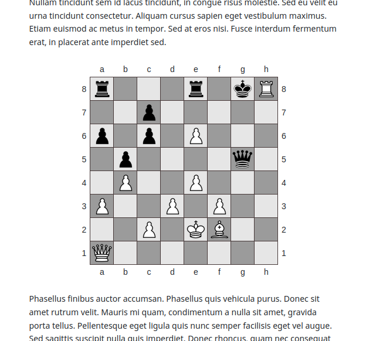

# jekyll-chess
A jekyll plugin for displaying static chess boards.

## How to Install

Currently, to use this plugin you have to set it up manually. 
Download or clone this repository and follow the steps below:

1. Copy `plugin/chess.rb` to your _plugins folder.
2. Copy `sass/chess.scss` to your _sass folder if your site is configured to use SASS. Alternatively, copy the precompiled chess.css to where you keep your style sheets.
3. Copy the images of the chess pieces in `assets` to whereever you would like them.
4. Update the `$assets-root` variable to match the path to the images of the chess pieces, or manually update the paths if you are using the css file.
5. Finally, use `` to render a chess board on your string. For example: `` render the below image.

  

## Usage

### Fen Board
Here is how you render a chess board using FEN notation.

``

Ex: ``

  
## Features
Currently, the only notation supported by jekyll-chess is FEN notation. PGN will hopefully be supported in the future.

### FEN Notation

FEN Notation represents a chess board at a single point in time. It looks like this:

> r3r1kR/2p5/p1p1P3/1p4q1/1P2P3/P2P1P2/2P1KB2/Q7 b - - 2 27

A FEN String is made up of six pieces. The first chunk represented by `r3r1kR/2p5/p1p1P3/1p4q1/1P2P3/P2P1P2/2P1KB2/Q7` describes the location of pieces on the board from Whites perspective from rank eight to rank one. Each rank is seperated by a backslash. White's pieces are capitalized while Black's are lowercase. And empty squares are represented by digits one through eight. For example, the above FEN String tells us that there is a Black Rook on square A8, B8, C8, and D8 are empty, a rook on E8, F8 is empty, Black's King, and then a White Rook.

The second piece of information represents whose it is: 'b' or 'w'. The third part tells if castling is possible for example:
  
 `rnbqkbnr/pppppppp/8/8/4P3/8/PPPP1PPP/RNBQKBNR b KQkq e3 0 1`

KQkq means that both White and Black can castle King side or Queen side. If castling can't be done by anyone it is represented by a '-'.
The fourth piece indicates if *en passant* is available on which square can be targeted. It is also represented by a '-' is unavailable.
The fifth and sixth pieces of information are a halfmove clock, used to determine if the fifty-fifty move rule can be applied, and the fullmove number representing the number of full turns that have passed in the game.
  
The only information that jekyll-chess really cares about is the first chunk representing piece positions. The plugin will still function if the only information you gave it was:
  
`r3r1kR/2p5/p1p1P3/1p4q1/1P2P3/P2P1P2/2P1KB2/Q7`
 
  
